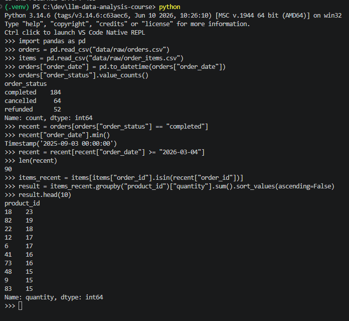
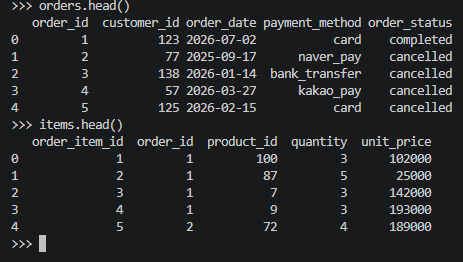
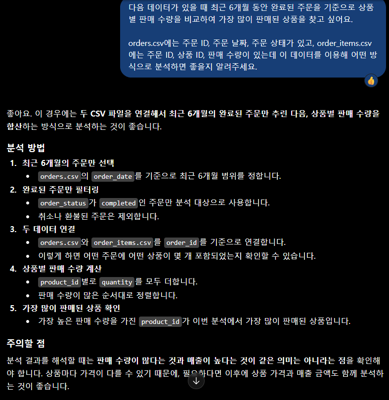
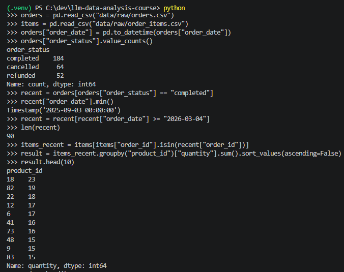
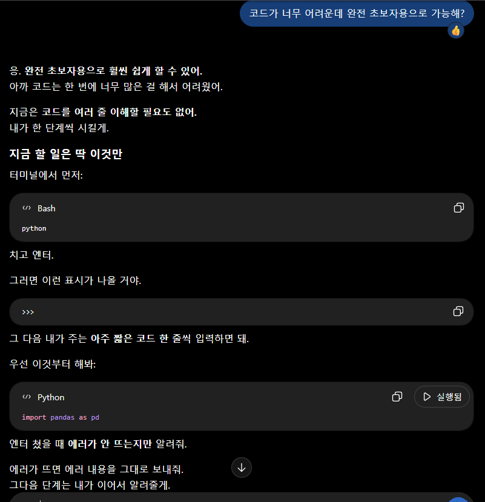
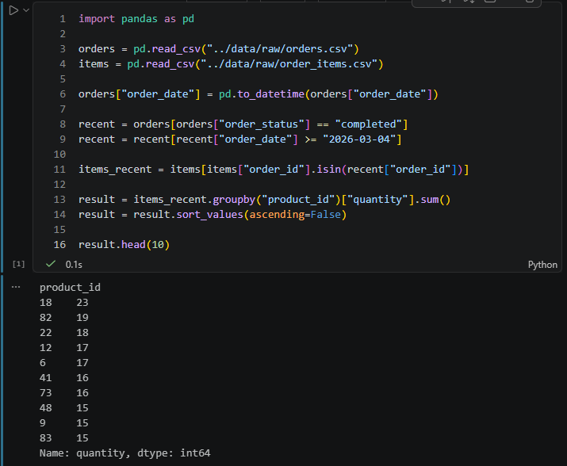

# Chapter 01. AI와 함께하는 데이터 분석의 시작

## 0. 제출 정보

- 이름:전예진
- GitHub ID:wjs0951467-wq
- 개인 저장소명:llm-data-analysis-course
- 작성일:2026-09-04
- 사용 LLM:ChatGPT
- 최종 제출 URL:https://github.com/wjs0951467-wq/llm-data-analysis-course/blob/main/chapter01/chapter01.md

---

## 1. 원래 업무 질문

### 1-1. 처음 떠올린 질문
최근에 어떤 상품이 가장 많이 팔리고 있는가?
### 1-2. 왜 이 질문만으로는 부족한가?
'최근'이라는 기간이 사람마다 기준이 다르고, '가장 많이 팔리고 있는가' 기준도 다 다르기 때문이다. 어떠한 기준으로 하는지 알 수 없기 때문에 실제ㅔ 데이터를 분석하기에는 질문이 구체적이거나 명확한 부분이 없다.
### 1-3. 분석 가능한 질문으로 다시 작성
최근 6개월 동안 완료된 주문을 기준으로 상품별 판매 수량을 비교했을 때, 가장 많이 판매된 상품은 무엇인가?
### 1-4. 결과 관찰
최근 6개월(2026-03-04 ~ 2026-09-04) 동안의 주문 중 completed 상태인 주문을 확인한 결과, 총 90건의 완료 주문이 있었다.
완료된 주문에 포함된 상품의 판매 수량을 비교한 결과, product_id 18 상품이 23개로 가장 많이 판매되었다. 그 다음으로 product_id 82가 19개, product_id 22가 18개 판매되었다.
### 1-5. 나의 해석과 판단
상품별 판매 수량을 비교한 결과 `product_id 18`이 가장 많이 판매된 상품으로 확인되었다. 따라서 현재 데이터 기준으로는 이 상품의 판매량이 다른 상품보다 높은 것으로 판단했다.
다만 판매 수량만으로 해당 상품의 성과가 가장 좋다고 단정하기는 어렵다고 생각했다. 객단가를 함께 확인하면 더 정확한 판단을 할 수 있을 것이다.
### 1-6. 업무·분석적 의미
상품별 판매 수량을 비교하면 어떤 상품이 많이 판매되고 있는지 빠르게 파악할 수 있다. 판매량이 높은 상품을 확인하면 재고 관리나 상품 운영, 향후 판매 전략을 세우는 데 참고할 수 있다.
특히 많이 판매되는 상품을 추가로 분석하면 인기 상품의 특징을 파악하고 다른 상품과 비교하는 데 도움이 될 수 있다.
### 1-7. 한계와 추가 확인 사항
이번 분석은 최근 6개월 동안 완료된 주문의 상품별 판매 수량만 비교했기 때문에 상품의 실제 매출이나 수익성을 모두 확인할 수 없다는 한계가 있다.
추가로 상품별 가격과 매출 금액, 주문 건수, 취소 및 환불 여부 등을 확인하면 어떤 상품이 실제로 좋은 성과를 내고 있는지 더 정확하게 판단할 수 있을 것이다.

### Evidence

---

## 2. 질문과 필요한 데이터 연결

### 2-1. 필요한 데이터 파일
분석을 위해 orders.csv와 order_items.csv 파일이 필요하다.
orders.csv에서는 주문 날짜와 주문 상태를 확인하고, order_items.csv에서는 각 주문에 포함된 상품과 판매 수량을 확인했다.
### 2-2. 필요한 컬럼
orders.csv에서는 다음 컬럼이 필요하다.
- order_id: 주문을 구분하기 위한 주문 번호
- order_date: 주문 날짜
- order_status: 주문 상태
order_items.csv에서는 다음 컬럼이 필요하다.
- order_id: 주문을 연결하기 위한 주문 번호
- product_id: 상품 번호
- quantity: 판매 수량
### 2-3. 데이터 간 관계
orders.csv와 order_items.csv는 order_id를 기준으로 연결할 수 있다.
orders.csv에서 완료된 주문을 먼저 확인한 뒤, 같은 order_id를 가진 order_items.csv의 상품과 판매 수량을 확인하여 상품별 판매량을 계산할 수 있다.
### 2-4. 결과 관찰
최근 6개월 동안 완료된 주문 90건을 대상으로 상품별 판매 수량을 확인했다.
그 결과 product_id 18이 23개로 가장 많이 판매되었으며, product_id 82는 19개, product_id 22는 18개가 판매되었다.
### 2-5. 나의 해석과 판단
상품별 판매 수량을 확인하기 위해서는 주문 정보와 주문 상품 정보가 모두 필요하다고 판단했다.
주문 상태와 날짜는 orders.csv에서 확인하고, 실제 상품별 판매 수량은 order_items.csv에서 확인하는 방식이 적절하다고 판단했다.
### 2-6. 업무·분석적 의미
하나의 데이터 파일만 확인하는 것이 아니라 필요한 데이터를 연결하면 업무 질문에 더 정확하게 답할 수 있다는 것을 확인했다.
특히 주문 정보와 상품 정보를 연결하면 특정 기간의 완료된 주문에서 어떤 상품이 많이 판매되었는지 분석할 수 있다.
### 2-7. 한계와 추가 확인 사항
이번 분석에서는 상품별 판매 수량만 확인했기 때문에 상품의 매출이나 이익까지 판단하기에는 한계가 있다.
추가로 상품 가격, 매출 금액, 고객 정보 등을 확인하면 상품 판매 현황을 더 다양한 관점에서 분석할 수 있을 것이다.
### Evidence

---

## 3. LLM에게 분석 질문 후보 요청

### 3-1. 요청 목적
현재 정의한 분석 질문을 해결하기 위해 어떤 분석 방법을 사용할 수 있는지 확인하고, 추가로 고려할 만한 분석 질문이 있는지 LLM에게 요청했다.
### 3-2. 실제 프롬프트
다음 데이터가 있을 때 최근 6개월 동안 완료된 주문을 기준으로 상품별 판매 수량을 비교하여 가장 많이 판매된 상품을 찾고 싶어요.
orders.csv에는 주문 ID, 주문 날짜, 주문 상태가 있고, order_items.csv에는 주문 ID, 상품 ID, 판매 수량이 있는데 이 데이터를 이용해 어떤 방식으로 분석하면 좋을지 알려주세요.
### 3-3. LLM 답변 요약
orders.csv에서 최근 6개월의 완료된 주문을 먼저 선택한 후, order_id를 기준으로 order_items.csv와 연결하는 방법을 제안했다.
그 다음 상품별 quantity를 합산하여 판매 수량이 가장 많은 상품을 확인하는 방법을 제안했다.
### 3-4. 결과 관찰
LLM은 주문 날짜와 주문 상태를 이용해 분석 대상 주문을 먼저 정하고, order_id를 기준으로 주문 정보와 상품 정보를 연결한 뒤 quantity를 상품별로 합산하는 방법을 제안했다.
### 3-5. 나의 해석과 판단
LLM이 제안한 방법은 내가 정한 분석 질문과 데이터 구조에 적합하다고 판단했다. 특히 주문 상태를 먼저 확인하고 상품별 판매 수량을 계산하는 과정이 분석 목적에 맞다고 생각했다.
### 3-6. 업무·분석적 의미
LLM을 활용하면 분석을 시작할 때 어떤 데이터를 사용하고 어떤 순서로 분석해야 하는지 아이디어를 얻을 수 있다. 이를 통해 분석 방법을 정하는 시간을 줄일 수 있다.
### 3-7. 한계와 추가 확인 사항
LLM이 제안한 분석 방법이 항상 정확하다고 볼 수 없기 때문에 실제 데이터의 구조와 분석 결과를 직접 확인해야 한다.
또한 상품별 판매 수량만으로 상품의 전체적인 성과를 판단하기에는 한계가 있으므로 가격이나 매출 등의 추가 데이터도 확인할 필요가 있다.
### Evidence

---

## 4. LLM 제안 검증

### 4-1. 선택한 분석 제안
LLM이 제안한 방법 중 최근 6개월 동안의 완료된 주문을 먼저 필터링하고, order_id를 기준으로 orders.csv와 order_items.csv를 연결한 뒤 상품별 quantity를 합산하는 방법을 선택했다.
### 4-2. 실제 데이터 확인
실제 데이터를 이용하여 orders.csv에서 order_status가 completed인 주문을 확인했다. 그중 최근 6개월에 해당하는 주문을 필터링한 결과 총 90건의 완료 주문이 확인되었다.
이후 order_id를 기준으로 order_items.csv의 상품 정보를 연결하고 상품별 quantity를 합산했다.
### 4-3. 최종 판단
LLM이 제안한 분석 방법이 실제 데이터 구조와 일치했으며, 분석 결과를 확인하는 데 적절한 방법이라고 판단했다.
실제 분석 결과 product_id 18이 23개로 가장 많이 판매된 상품으로 확인되었다.
### 4-4. 수정한 내용
LLM의 분석 방법을 그대로 사용하기보다는 실제 데이터에 맞게 최근 6개월의 기준 날짜와 완료된 주문의 조건을 적용했다.
최근 6개월의 기준은 2026-03-04부터 2026-09-04까지로 설정했다.
### 4-5. 결과 관찰
최근 6개월 동안 완료된 주문은 총 90건으로 확인되었다.
상품별 판매 수량을 계산한 결과 product_id 18이 23개로 가장 많이 판매되었고, product_id 82가 19개, product_id 22가 18개 판매되었다.
### 4-6. 나의 해석과 판단
실제 데이터를 확인한 결과 LLM이 제안한 분석 방법으로 원하는 결과를 확인할 수 있었다. 따라서 이번 분석에서는 LLM의 제안을 그대로 활용해도 적절하다고 판단했다.
다만 분석 결과 자체는 사람이 직접 데이터를 확인하고 검증해야 한다고 판단했다.
### 4-7. 업무·분석적 의미
LLM의 분석 방법을 실제 데이터에 적용해 보면 제안한 방법이 실제 업무 질문에 적합한지 확인할 수 있다.
이번 과정을 통해 LLM의 답변을 그대로 믿기보다 실제 데이터를 이용해 검증하는 과정이 중요하다는 것을 확인했다.
### 4-8. 한계와 추가 확인 사항
이번 분석에서는 상품별 판매 수량만 비교했기 때문에 판매량이 많은 상품이 반드시 가장 높은 매출이나 이익을 내는 상품이라고 판단할 수는 없다.
추가로 상품 가격과 매출 금액 등을 확인하면 상품의 성과를 더 정확하게 판단할 수 있다.
### Evidence

---

## 5. Prompt Log

### 5-1. 프롬프트 목적
최근 6개월 동안 완료된 주문을 기준으로 상품별 판매 수량을 분석하기 위해 적절한 분석 방법을 LLM에게 요청했다.
### 5-2. 프롬프트 요약
orders.csv와 order_items.csv를 이용하여 최근 6개월 동안 완료된 주문을 대상으로 상품별 판매 수량을 비교하고 가장 많이 판매된 상품을 찾는 방법을 질문했다.
### 5-3. LLM 답변 요약
LLM은 최근 6개월의 주문 중 완료된 주문만 필터링한 후 order_id를 기준으로 두 데이터를 연결하고, 상품별 quantity를 합산하여 판매 수량을 비교하는 방법을 제안했다.
### 5-4. 실제 반영 여부
LLM이 제안한 분석 방법을 실제 데이터에 적용했다. 완료된 주문을 필터링하고 최근 6개월의 데이터를 선택한 다음 상품별 판매 수량을 계산했다.
### 5-5. 사람이 확인한 내용
실제 데이터를 확인하여 completed 상태의 주문만 분석에 포함되는지 확인했다. 또한 최근 6개월의 완료된 주문이 총 90건임을 확인하고 상품별 판매 수량 계산 결과를 확인했다.
### 5-6. 사람이 수정한 내용
LLM의 분석 방법을 실제 데이터에 적용하면서 최근 6개월의 기준을 2026-03-04부터 2026-09-04까지로 설정했다.
### 5-7. 남은 확인 사항
현재 분석에서는 상품별 판매 수량만 확인했기 때문에 상품별 매출 금액이나 이익까지는 확인하지 못했다. 추가 분석을 위해 상품 가격과 매출 관련 데이터를 확인할 필요가 있다.
### 5-8. 결과 관찰
실제 분석 결과 product_id 18이 23개로 가장 많이 판매된 상품으로 확인되었다.
### 5-9. 나의 해석과 판단
LLM의 제안은 실제 데이터에 적용할 수 있었지만, 분석 조건과 결과를 사람이 직접 확인하는 과정이 필요하다고 판단했다. LLM은 분석 방법을 제안하는 데 도움을 주었고, 최종 결과의 확인과 판단은 사람이 해야 한다고 생각했다.
### Evidence

---

## 6. 개인정보와 Secret 보호 확인

- 실제 고객 개인정보를 프롬프트에 입력하지 않았는가? O
- API Key를 코드나 노트북에 입력하지 않았는가? O
- 실제 `.env` 파일을 GitHub에 올리지 않았는가? O
- GitHub Token, 비밀번호 등을 캡처에 포함하지 않았는가? O
- 내부 URL이나 민감한 정보를 공개하지 않았는가? O

### 나의 확인 및 판단
이번 분석에서는 실제 고객 개인정보나 민감한 정보를 사용하지 않았으며, CSV 데이터의 상품 및 주문 정보를 이용하여 분석을 진행했다.
또한 API Key, GitHub Token, 비밀번호 등의 Secret 정보를 코드나 프롬프트에 입력하지 않았으며, .env 파일이나 민감한 정보가 포함된 파일을 GitHub에 공개하지 않도록 확인했다.
---

## 7. Chapter 01 Notebook 확인

- Notebook 위치:
  `notebooks/ch01_ai_data_analysis_intro.ipynb`

### 환경 상태
VS Code에서 Jupyter Notebook을 실행했으며, Python과 pandas를 이용하여 분석을 진행했다.
### 실행 결과
Notebook에서 orders.csv와 order_items.csv를 불러온 후 최근 6개월 동안의 완료된 주문을 필터링하고 상품별 판매 수량을 계산했다.(터미널(python)에서 사용했던 코드 그대로 사용)
실행 결과 product_id 18이 23개로 가장 많이 판매된 상품으로 확인되었다.
### Evidence

---

## 8. Chapter 01 최종 해석

### 가장 중요하게 배운 점
이번 과제를 통해 LLM에게 질문하는 것만으로 분석이 끝나는 것이 아니라, 실제 데이터를 확인하고 LLM이 제안한 분석 방법이 적절한지 직접 검증하는 과정이 중요하다는 것을 배웠다.
또한 처음 질문을 구체적으로 정의해야 원하는 분석 결과를 얻을 수 있다는 것을 확인했다.
### LLM을 사용할 때 주의할 점
LLM이 제안하는 분석 방법이나 코드를 그대로 믿기보다는 실제 데이터와 비교하여 결과가 올바른지 확인해야 한다.(무한신뢰 금지)
또한 개인정보, API Key, 비밀번호 등의 민감한 정보를 LLM에게 입력하지 않도록 주의해야 한다.
### 사람과 LLM의 역할

| 구분 | 사람 | LLM |
|---|---|---|
| 질문 정의 | 업무 목적에 맞게 질문을 구체화 | 질문을 구체화하는 방법 제안 |
| 분석 방법 제안 | 제안 내용을 검토 | 분석 방법과 코드 제안 |
| 데이터 확인 | 실제 데이터와 구조 확인 | 데이터 분석 방법 안내 |
| 결과 검증 | 실제 결과를 확인하고 오류 검토 | 결과 해석에 도움 |
| 최종 판단 | 최종 결과를 판단 | 판단을 위한 의견 제공 |

### 다음 Chapter에서 확인할 것
다음 Chapter에서는 실제 데이터를 불러오고 정리하는 방법을 학습하면서 데이터 분석에 필요한 기본적인 Python과 pandas 사용법을 익히고 싶다.
---

## 9. 최종 체크리스트

- [X] 질문을 구체적으로 정의했는가?
- [X] 필요한 데이터를 확인했는가?
- [X] LLM에게 분석 방법을 요청했는가?
- [X] LLM의 제안을 실제 데이터와 비교했는가?
- [X] 나의 해석과 판단을 작성했는가?
- [X] Evidence를 준비했는가?
- [X] 개인정보와 Secret을 확인했는가?
- [X] GitHub에 제출할 파일을 확인했는가?

---

## 10. Instructor Summary

- 완료 상태: Chapter 01의 분석 질문 정의부터 필요한 데이터 확인, LLM 분석 방법 요청, 실제 데이터 검증, Notebook 실행까지 완료했다.
- 가장 중요한 판단: LLM이 제안한 분석 방법은 실제 데이터에 적용할 수 있었으며, 검증 결과 최근 6개월의 완료된 주문에서 `product_id 18`이 23개로 가장 많이 판매된 상품으로 확인되었다. 최종 결과는 사람이 직접 데이터를 확인하고 판단해야 한다고 생각했다.
- 아직 확인이 필요한 내용: 상품별 판매 수량만으로는 실제 매출이나 이익을 판단하기 어렵기 때문에 상품 가격, 매출 금액 등의 추가 분석이 필요하다.