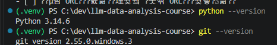
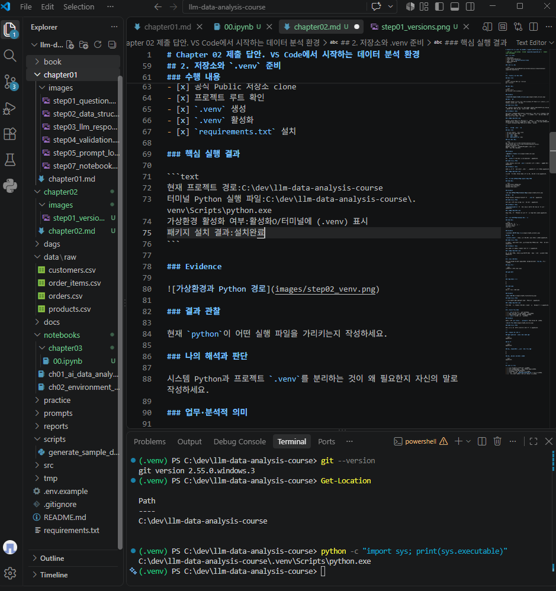
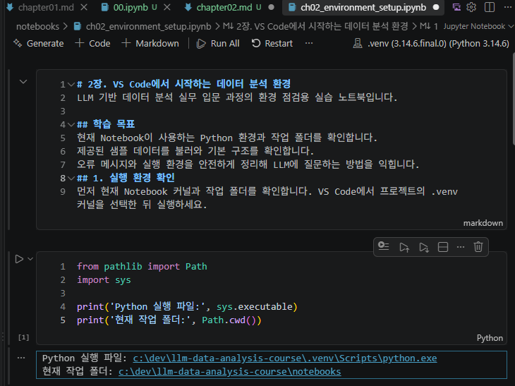
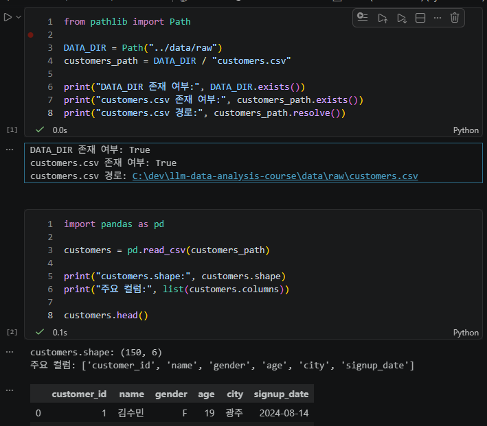
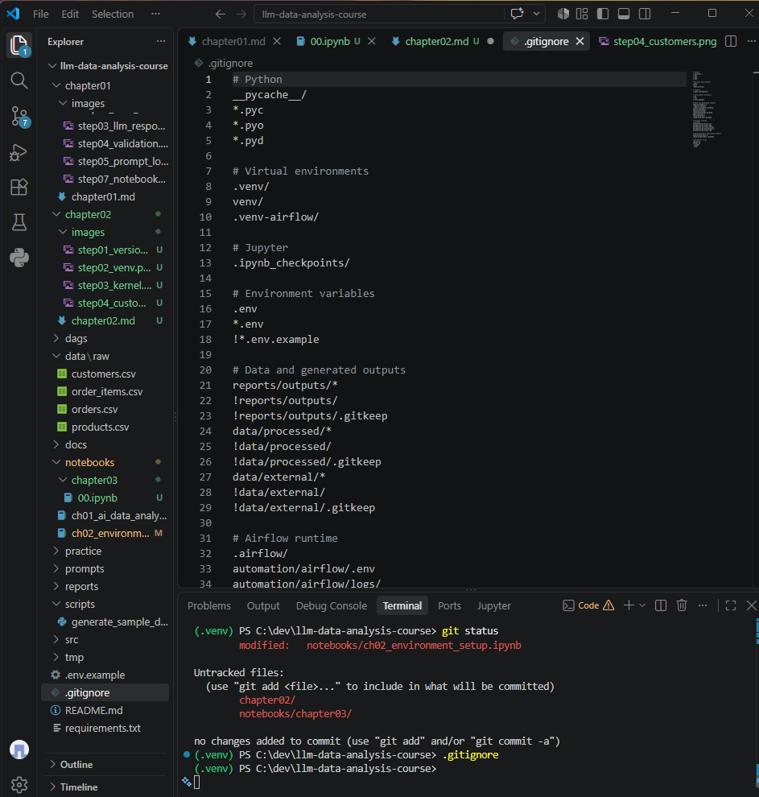

# Chapter 02 제출 답안. VS Code에서 시작하는 데이터 분석 환경

> 최종 파일은 개인 GitHub 저장소의 `chapter02/chapter02.md`로 저장하는 것을 권장합니다.

## 0. 제출 정보

- 이름:전예진
- GitHub ID:wjs0951467-wq
- 개인 저장소: `llm-data-analysis-course`
- 작성일:2026-09-04
- 운영체제:Windows 11

### 최종 제출 URL

```text
https://github.com/wjs0951467-wq/llm-data-analysis-study/blob/main/chapter02/chapter02.md
```

---

## 1. Python과 Git 환경 확인

### 실행 내용

```text
python --version 또는 py --version
git --version
```

### 실행 결과

```text
Python 3.14.6
git version 2.55.0.windows.3
```

### Evidence



### 결과 관찰

오류없이 Python 3.14.6과 Git 2.55.0.windows.3이 정상적으로 출력되었음으로 Python과 Git을 사용할 수 있다.

### 나의 해석과 판단

현재 Python과 Git이 정상적으로 실행되므로 Chapter 02의 데이터 분석 환경을 구성하기 위한 기본 도구가 준비되어 있다고 판단한다.

### 업무·분석적 의미

프로젝트를 시작하기 전에 Python과 Git의 설치 및 실행 상태를 확인하면 이후 가상환경 생성, 패키지 설치, 저장소 관리 과정에서 발생할 수 있는 기본적인 환경 문제를 미리 확인할 수 있다.

### 한계와 추가 확인 사항

Python과 Git이 정상적으로 실행되는 것은 확인했지만, 아직 프로젝트 전용 가상환경의 실제 Python 경로와 필요한 패키지 설치 상태, VS Code 인터프리터 및 Jupyter Notebook 커널 연결 상태는 확인하지 않았다.

---

## 2. 저장소와 `.venv` 준비

### 수행 내용

- [x] 공식 Public 저장소 clone
- [x] 프로젝트 루트 확인
- [x] `.venv` 생성
- [x] `.venv` 활성화
- [x] `requirements.txt` 설치

### 핵심 실행 결과

```text
현재 프로젝트 경로:C:\dev\llm-data-analysis-course
터미널 Python 실행 파일:C:\dev\llm-data-analysis-course\.venv\Scripts\python.exe
가상환경 활성화 여부:활성화O/터미널에 (.venv) 표시
패키지 설치 결과:설치완료
```

### Evidence



### 결과 관찰

현재 프로젝트 경로는 C:\dev\llm-data-analysis-course이며, 터미널에서 실행되는 Python은 프로젝트 내부의 .venv\Scripts\python.exe를 가리키고 있었다. 또한 터미널 앞에 (.venv)가 표시되어 가상환경이 활성화된 상태임을 확인했다.

### 나의 해석과 판단

시스템 전체에서 사용하는 Python과 프로젝트 전용 .venv를 분리하면 프로젝트마다 필요한 패키지와 실행 환경을 독립적으로 관리할 수 있다. 현재 Python 실행 경로가 프로젝트의 .venv를 가리키고 있으므로 가상환경이 정상적으로 적용되었다고 판단했다.

### 업무·분석적 의미

프로젝트별로 가상환경을 사용하면 다른 프로젝트의 패키지 버전과 충돌하는 문제를 줄일 수 있다. 또한 다른 사람이 동일한 프로젝트를 실행할 때 필요한 패키지와 Python 환경을 일관되게 구성하는 데 도움이 된다.

### 한계와 추가 확인 사항

현재 PC에서는 .venv가 정상적으로 동작하는 것을 확인했지만, 다른 PC에서는 Python 버전이나 운영체제, 회사·기관의 보안 정책 등에 따라 동일한 환경을 구성하는 과정에서 차이가 발생할 수 있다.

---

## 3. VS Code 인터프리터와 Jupyter 커널 연결

### 확인 결과

```text
VS Code Python 인터프리터:.venv (3.14.6.final.0) (Python 3.14.6)
Notebook sys.executable:C:\dev\llm-data-analysis-course\.venv\Scripts\python.exe
Notebook Path.cwd():C:\dev\llm-data-analysis-course\notebooks
```

### Evidence



### 결과 관찰

VS Code의 Notebook 커널이 .venv (Python 3.14.6)으로 선택되어 있었으며, sys.executable 결과에서도 프로젝트의 .venv\Scripts\python.exe가 확인되었다. Path.cwd()는 현재 실행 중인 Notebook이 위치한 notebooks 폴더를 가리키고 있었다.

### 나의 해석과 판단

VS Code의 Python 인터프리터와 Notebook의 Python 실행 파일이 동일한 프로젝트의 .venv를 사용하고 있으므로 같은 가상환경으로 연결되어 있다고 판단했다. 현재 작업 폴더는 notebooks이므로 상대 경로를 사용할 때 이 위치를 기준으로 경로가 해석될 수 있다는 점도 확인했다.

### 업무·분석적 의미

Python 인터프리터와 Notebook 커널을 동일한 .venv로 연결하면 터미널에서 설치한 패키지를 Notebook에서도 동일하게 사용할 수 있다. 이를 통해 패키지를 설치했음에도 ModuleNotFoundError가 발생하는 환경 불일치 문제를 줄일 수 있다.

### 한계와 추가 확인 사항

커널 이름만으로 실제 Python 환경을 판단하면 안 된다. 따라서 sys.executable을 통해 실제 Python 실행 파일 경로를 확인해야 한다. 또한 Path.cwd()가 프로젝트 루트가 아니라 notebooks 폴더를 가리키므로 상대 경로를 사용할 때 현재 작업 폴더를 고려해야 한다.

---

## 4. 샘플 데이터와 Notebook 실행 검증

### 확인 결과

```text
DATA_DIR 존재 여부:True
customers.csv 존재 여부:True
customers.shape:(150,6)
주요 컬럼:['customer_id', 'name', 'gender', 'age', 'city', 'signup_date']
```

### Evidence



### 결과 관찰

customers.csv 파일이 정상적으로 존재하는 것을 확인했고, pandas를 사용하여 데이터를 DataFrame으로 불러올 수 있었다. 데이터 크기는 (150, 6)으로 150개의 행과 6개의 열로 구성되어 있다. 컬럼은 customer_id, name, gender, age, city, signup_date로 확인되었다.

### 나의 해석과 판단

데이터 폴더와 customers.csv 파일의 경로가 정상적으로 연결되어 있었고, pandas를 이용해 CSV 파일을 문제없이 불러올 수 있었다. 따라서 현재 Notebook에서 Python과 데이터 파일이 정상적으로 연결되어 있다고 판단했다.

### 업무·분석적 의미

실제 데이터 분석을 시작하기 전에 데이터 파일이 정상적으로 존재하는지 확인하고 직접 불러와 보는 과정이 필요하다. 이렇게 기본적인 실행 환경을 먼저 확인하면 분석을 시작한 후 파일 경로나 환경 설정 문제로 오류가 발생하는 것을 줄일 수 있다.

### 한계와 추가 확인 사항

이번 단계에서는 customers.csv가 정상적으로 불러와지는지와 데이터의 기본적인 크기 및 컬럼만 확인했다. 데이터에 결측값이나 중복값이 있는지, 데이터의 값이 올바른지와 같은 데이터 품질은 아직 자세히 확인하지 않았다.

---

## 5. 오류 해결 기록

해당없음

### 오류 메시지

```text
해당없음
```

### 원인 후보

1.
2.
3.

### 내가 확인한 순서

1.
2.
3.

### 해결 방법

```text
실제로 적용한 해결 방법
```

### Evidence


### 나의 해석과 판단

이번 실습에서는 Python 환경과 Notebook 커널이 정상적으로 연결되어 있었고, customers.csv 파일도 정상적으로 불러와졌기 때문에 별도의 오류가 발생하지 않았다. 따라서 오류의 원인을 추측하거나 해결 과정을 임의로 작성하지 않았다.

### 한계와 추가 확인 사항

실제 오류가 발생하지 않았기 때문에 특정 오류의 원인이나 해결 방법을 검증하지 못했다. 또한 문제를 해결하기 위해 보안 설정을 변경하거나 파일, 수업내용 등을 무분별하게 삭제하는 등의 조치는 수행하지 않았다.

---

## 6. Secret 보호 확인

- [x] `.env`는 Git 추적 대상이 아닙니다.
- [x] 실제 API Key를 코드에 작성하지 않았습니다.
- [x] 캡처 화면에 Token/비밀번호가 없습니다.
- [x] `.venv`를 Git에 올리지 않습니다.

### Evidence

필요한 경우 `git status`, `.gitignore` 확인 화면을 첨부합니다.



### 나의 해석과 판단

API Key나 비밀번호와 같은 비밀정보를 코드에 직접 작성하지 않고 별도로 관리하는 것이 중요하다. 비밀정보가 Git에 올라가면 다른 사람이 저장소를 통해 확인할 수 있어 보안 문제가 발생할 수 있기 때문이다.
또한 .venv와 같은 가상환경 폴더는 프로젝트 실행에 필요한 환경이지만 저장소에 그대로 올릴 필요가 없으므로 Git에서 제외하는 것이 적절하다.

---

## 7. Chapter 02 최종 회고

### 가장 중요했다고 생각한 환경 설정 1가지

```text
VS Code의 Python 인터프리터와 Jupyter Notebook 커널을 프로젝트의 `.venv`로 연결하는 것이 가장 중요하다고 생각한다.
```

### 그 이유

```text
터미널과 Notebook이 서로 다른 Python 환경을 사용하면 설치한 패키지를 Notebook에서 찾지 못하는 등의 문제가 발생할 수 있기 때문이다. 이번 실습에서 sys.executable을 확인하여 Notebook도 프로젝트의 `.venv`를 사용하고 있는 것을 확인했다.
```

### 다음 Chapter에서 재사용할 환경 체크 3가지

1.Python 실행 파일이 프로젝트의 .venv를 가리키는지 확인한다.
2.Notebook의 sys.executable과 Path.cwd()를 확인한다.
3.데이터 파일의 존재 여부와 경로를 먼저 확인한 후 분석을 시작한다.

### 현재 환경의 한계 또는 주의점

```text
현재 환경에서는 Python, 가상환경, Notebook 커널과 데이터 파일이 정상적으로 연결되는 것을 확인했다. 다만 운영체제나 Python 버전, 패키지 버전에 따라 다른 환경에서는 실행 결과가 달라질 수 있으므로 프로젝트를 실행할 때 환경과 경로를 함께 확인해야 한다.
```

---

## 최종 제출 체크

- [x] 핵심 Evidence 4~7장을 첨부했습니다.(6제외)
- [x] 단순 캡처가 아니라 관찰과 판단을 작성했습니다.
- [x] Secret/개인정보가 없습니다.
- [x] GitHub에서 이미지가 정상 표시됩니다.
- [x] 개인 저장소에 `chapter02/chapter02.md`를 업로드했습니다.
- [x] 저장소 URL이 아니라 최종 파일 URL을 제출합니다.